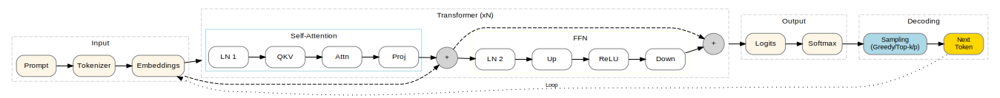
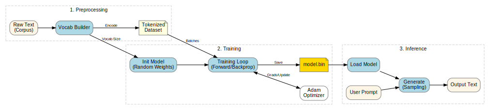

<div align="center">
  <picture>
    
  </picture>
<br>

<h2>ZigFormer</h2>

[](https://github.com/CogitatorTech/zigformer/actions/workflows/tests.yml)
[](https://github.com/CogitatorTech/zigformer/blob/main/LICENSE)
[](https://CogitatorTech.github.io/zigformer/)
[](https://ziglang.org/download/)
[](https://github.com/CogitatorTech/zigformer/releases/latest)

An educational transformer-based LLM in pure Zig

</div>

---

ZigFormer is a fully functional implementation of a transformer-based large language model (LLM) written in Zig
programming language.
It aims to provide a clean, easy-to-understand LLM implementation with no large dependencies like PyTorch or TensorFlow.
ZigFormer was mainly made for learning how a conventional transformer-based LLM works under the hood and is
inspired by Andrej Karpathy's [nanoGPT](https://github.com/karpathy/nanoGPT)
and [nanochat](https://github.com/karpathy/nanochat) projects, and follows the architecture described in the
["Attention Is All You Need"](https://arxiv.org/abs/1706.03762) and
["Language Models are Unsupervised Multitask Learners"](https://cdn.openai.com/better-language-models/language_models_are_unsupervised_multitask_learners.pdf)
papers.

The diagrams below show the high-level architecture and its core components.





### Features

- Implements core transformer architecture with multi-head self-attention
- Supports both pretraining and instruction fine-tuning
- Provides multiple decoding strategies (like greedy and beam search)
- Includes a CLI for training and inference
- Has a web-based UI for interactive chatting with the model
- Supports model checkpointing and the use of configuration files

See the [ROADMAP.md](ROADMAP.md) for the list of implemented and planned features.

> [!IMPORTANT]
> ZigFormer is in early development, so bugs and breaking changes are expected.
> Please use the [issues page](https://github.com/CogitatorTech/zigformer/issues) to report bugs or request features.

---

### Getting Started

You can get started with ZigFormer by following the steps below.

#### Installation

```bash
git clone https://github.com/CogitatorTech/zigformer.git
cd zigformer
zig build
```

> [!IMPORTANT]
> ZigFormer is developed and tested with Zig 0.15.2.
> It should work with newer versions, but it is not guaranteed.

#### Training a Model

```bash
zig build run -- --save-model model.bin
```

This will:

1. Load the training datasets from `datasets/simple_dataset/`
2. Build a vocabulary of tokens from the data
3. Pre-train the model on the pretraining examples (raw text)
4. Fine-tune the model on the instruction-following examples (question-answer pairs)
5. Save the trained model to `model.bin`

Training parameters can be given through a configuration file or CLI arguments.

```bash
zig build run -- --config my_config.json
```

**Sample CLI Configuration:**

```json
{
    "pretrain_path": "datasets/simple_dataset/pretrain.json",
    "train_path": "datasets/simple_dataset/train.json",
    "pre_epochs": 10,
    "chat_epochs": 10,
    "batch_size": 32,
    "accumulation_steps": 1,
    "pre_lr": 0.0005,
    "chat_lr": 0.0001,
    "save_model_path": "model.bin",
    "interactive": true
}
```

> [!IMPORTANT]
> A saved model only works with the model with the same configuration.

#### Using the Web UI

You can run the web-based UI to chat with the trained model:

```bash
zig build run-gui -- --load-model model.bin
```

The UI can be accessed at http://localhost:8085 by default.

You can also provide a configuration file for the UI:

```bash
zig build run-gui -- --config gui_config.json
```

**Sample Web UI Configuration:**

```json
{
    "port": 8085,
    "host": "0.0.0.0",
    "pretrain_path": "datasets/simple_dataset/pretrain.json",
    "train_path": "datasets/simple_dataset/train.json",
    "load_model_path": "model.bin",
    "max_request_size": 1048576,
    "max_prompt_length": 1000,
    "timeout_seconds": 30
}
```

#### Available Options (CLI and Web UI)

```bash
zig build run -- --help
zig build run -- predict --help
zig build run-gui -- --help
```

#### Example Usage

```bash
# Make sure to train the model first
zig build run -- --save-model model.bin
```

```bash
# Inference with greedy decoding
zig build run -- predict --prompt "How do mountains form?" --beam-width 5
```

```bash
zig build run -- predict --prompt "How do mountains form?" --top-k 5 --load-model model.bin
```

```bash
zig build run-gui -- --load-model model.bin
```

---

### Documentation

You can find the full API documentation for the latest release of
ZigFormer [here](https://CogitatorTech.github.io/zigformer/).

---

### Contributing

Contributions are always welcome!
See [CONTRIBUTING.md](CONTRIBUTING.md) for details on how to make a contribution.

### License

ZigFormer is licensed under the MIT License (see [LICENSE](LICENSE)).

### Acknowledgements

* The logo is from [SVG Repo](https://www.svgrepo.com/svg/357414/brain) with some modifications.
* This project uses the [Chilli](https://github.com/CogitatorTech/chilli) CLI framework.
